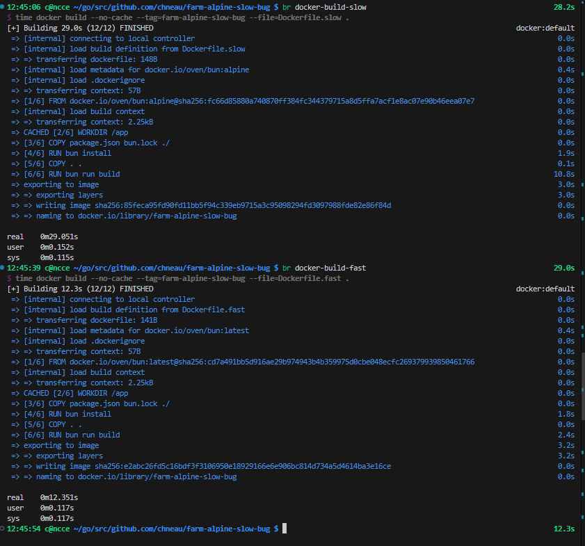

# Farm + React



```bash
bun run docker-build-fast
bun run docker-build-slow

# fast uses FROM oven/bun
# slow uses FROM oven/bun:alpine
```

Notice the build step is slower for the `:alpine` version.
